# Introduction
This guide provides instructions for flashing the Action LSC Smart Power Monitoring Plug with the WB2S Tuya board, featuring the [BK7231T MCU](https://developer.tuya.com/en/docs/iot/wb2s-module-datasheet?id=K9ghecl7kc479).

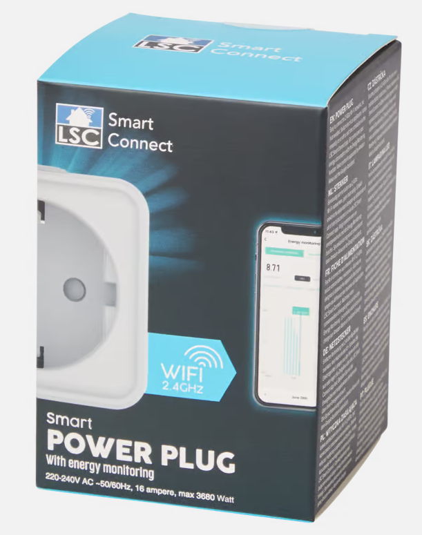

## Requirements:
* USB to TTL or UART reader
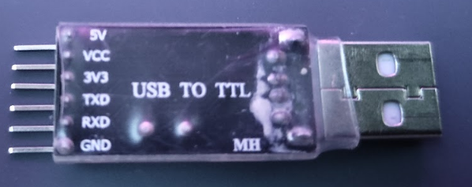
* Soldering iron
* Dupont cable or any wire for soldering
* [OpenBeken flasher software](https://openbekeniot.github.io/webapp/devicesList.html) or any other tool for flashing firmware.

# Step One

Begin by opening the smart plug case with a flat screwdriver.


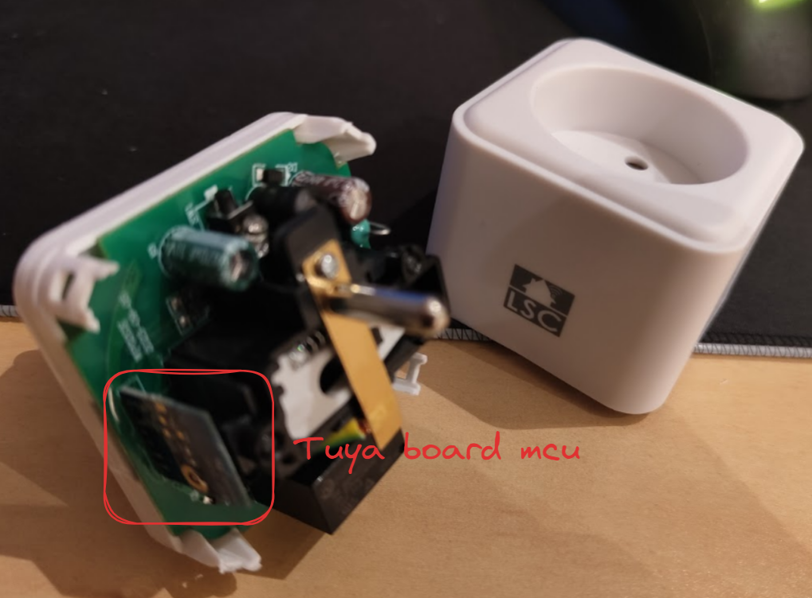


After opening, you should have access to the board.

# Step Two

Locate the Tuya board number on the back of the blue board:
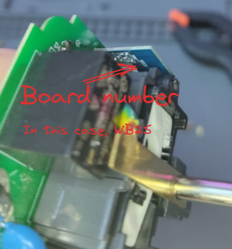
Google the board name, find Tuya documentation, and confirm the MCU (in this case, the board is a WB2S with [BK7231T MCU](https://developer.tuya.com/en/docs/iot/wb2s-module-datasheet?id=K9ghecl7kc479)). The manufacturer provides all the required data for flashing:

| Pin No. | Symbol | I/O type | Function                                               |
|---------|--------|----------|--------------------------------------------------------|
| 1       | VBAT   | P        | Power supply pin (3.3 V), connected to VBAT on IC      |
| 2       | PWM2   | I/O      | Common GPIO, connected to P8 on IC                     |
| 3       | GND    | P        | Power supply reference ground pin                     |
| 4       | PWM1   | I/O      | Common GPIO, connected to P7 on IC                     |
| 5       | 1RX    | I/O      | UART1_RXD, used as user-side serial interface, connected to P10 on IC |
| 6       | PWM0   | I/O      | Common GPIO, connected to P6 on IC                     |
| 7       | 1TX    | I/O      | UART1_TXD, used as user-side serial interface, connected to P11 on IC |
| 8       | AD     | AI       | ADC pin, connected to P23 on IC                        |
| 9       | PWM4   | I/O      | Common GPIO, connected to P24 on IC                    |
| 10      | CEN    | I        | Low-level reset, high-level active, Docking IC-CEN (internally pulled high) |
| 11      | PWM5   | I/O      | Common GPIO, connected to P26 on IC                    |

# Step Three

Solder wires on the GROUND, VBAT, RX, and TX pins. Highlighted pinout:

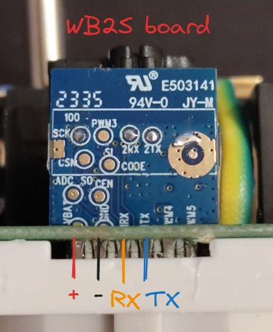

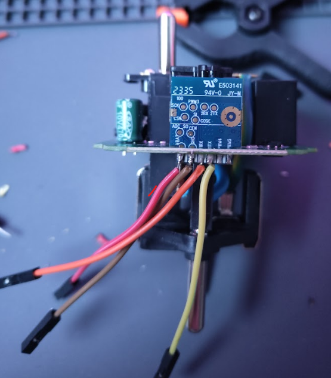

Connect pinout wires to the USB to UART adapter (ensure the MCU supports only 3.3V), and check Tuya RX is on the TTL board's TX and vice versa.

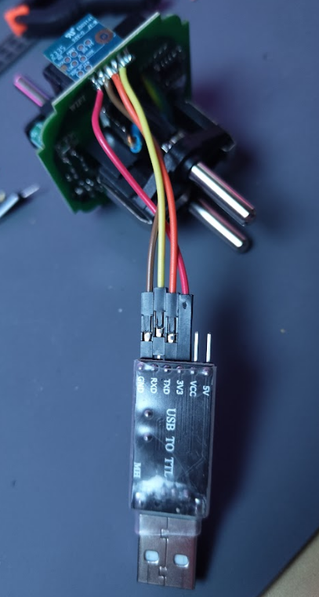

# Step Four

Plug the UART reader into your computer and launch [OpenBeken flasher software](https://openbekeniot.github.io/webapp/devicesList.html).

 

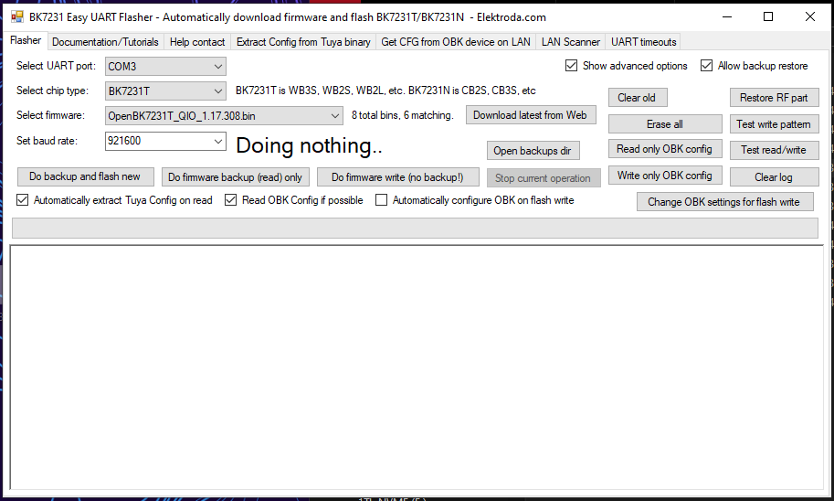

Start by making a firmware dump (backup) by clicking **Do firmware backup (read) only**.

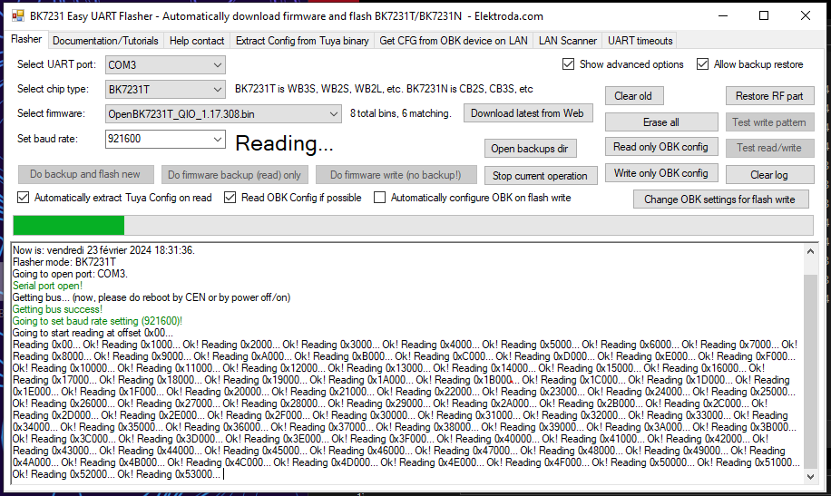

After making the backup, obtain the firmware pinout configuration in JSON, and save it.

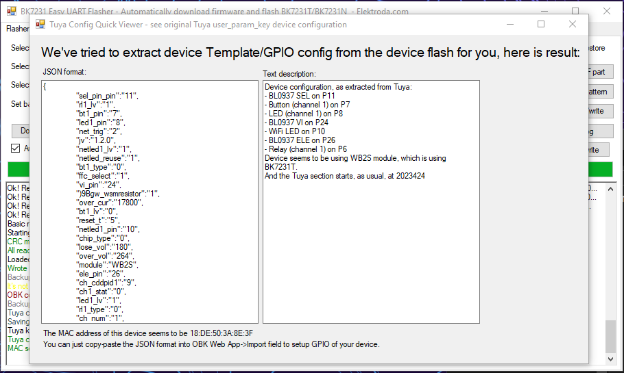

Locate the corresponding firmware and select the right one for your MCU, using the **_UA.bin** file, and click flash.

# Step Five

Unsolder all wires, put the board back in its enclosure, and plug it into an outlet. You should be able to see a WiFi hotspot:


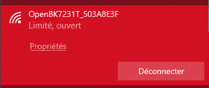

Go to the WiFi properties, enter the gateway IP in a web browser:

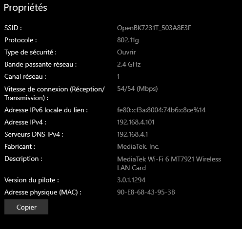

You should see a web page like this:


# Step Six

Configure the power plug by inserting the JSON obtained in Step Four. Go to **launch web app** and into **import**, paste the JSON, and click **clear OBK and apply new script**.


After that you should have the following page when you return to the base menu :

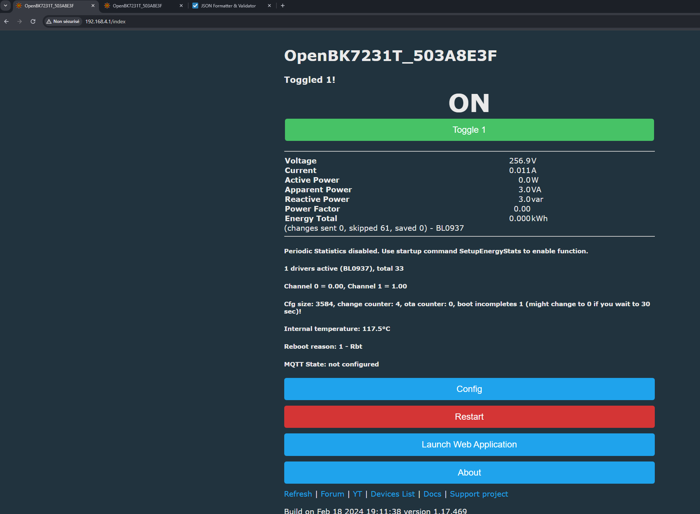

here my json obtained by reading the dump firmware :
```json
{
   "sel_pin_pin": 11,
   "rl1_lv": 1,
   "bt1_pin": 7,
   "led1_pin": 8,
   "net_trig": 2,
   "jv": "1.2.0",
   "netled1_lv": 1,
   "netled_reuse": 1,
   "bt1_type": 0,
   "ffc_select": 1,
   "vi_pin": 24,
   "resistor": 1,
   "over_cur": 17800,
   "bt1_lv": 0,
   "reset_t": 5,
   "netled1_pin": 10,
   "chip_type": 0,
   "lose_vol": 180,
   "over_vol": 264,
   "module": "WB2S",
   "ele_pin": 26,
   "ch_cddpid1": 9,
   "ch1_stat": 0,
   "led1_lv": 1,
   "rl1_type": 0,
   "ch_num": 1,
   "rl1_pin": 6,
   "vol_def": 0,
   "ch_dpid1": 1,
   "sel_pin_lv": 1,
   "crc": 10
}
```

# Congrat ! you have flash your action smart plug !
### Refer to [Tasmota Getting-Started](https://tasmota.github.io/docs/Getting-Started/#__tabbed_2_2)  or [OpenBeken website](https://openbekeniot.github.io/webapp/devicesList.html) guide for connecting this to you wifi and for using **MQTT**.